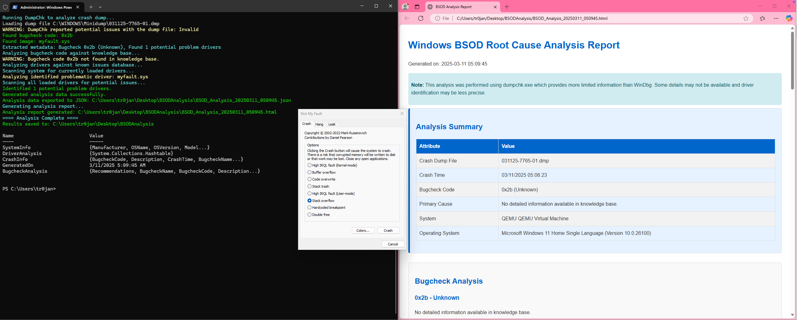

# BluSkreener

```bash
 ____  _       ____  _                                  
| __ )| |_   _/ ___|| | ___ __ ___  ___ _ __   ___ _ __ 
|  _ \| | | | \___ \| |/ / '__/ _ \/ _ \ '_ \ / _ \ '__|
| |_) | | |_| |___) |   <| | |  __/  __/ | | |  __/ |   
|____/|_|\__,_|____/|_|\_\_|  \___|\___|_| |_|\___|_|   
```

---

# Windows BSOD Root Cause Triage Tool - PowerShell

## Usage Guide

This guide explains how to use the Windows BSOD Root Cause Triage Tool for analyzing and identifying the causes of system crashes in Windows 11.

## Overview

The Windows BSOD Root Cause Triage Tool is designed to automate the analysis of crash dumps, identify problematic drivers, and provide actionable recommendations based on bugcheck codes. It combines several key components:

1. **Crash Dump Analysis**: Extracts metadata from Windows memory dumps.
2. **Driver Analysis**: Cross-references loaded drivers against a database of known problematic drivers.
3. **Bugcheck Knowledge Base**: Provides information about common bugcheck codes and their probable causes.
4. **System Event Correlation**: Examines system events around the time of the crash for additional context.

## Prerequisites

Before using the tool, ensure you have:

- Windows 11 operating system
- PowerShell 5.1 or later
- Administrator privileges
- Windows Debugging Tools installed (recommended but not required)
  - These are part of the Windows SDK, which can be downloaded from the Microsoft website

## Installation

1. Download all three files to the same directory:
   - `BSODRootCauseTriage.ps1` (main script)
   - `BugcheckKB.json` (bugcheck knowledge base)
   - `KnownBadDrivers.json` (problematic drivers database)

2. If you do not have Windows Debugging Tools installed, the script will still function but with reduced capabilities.

## In Action



## Basic Usage

### Analyzing the Latest Crash Dump

To analyze the most recent crash dump file on your system:

1. Open PowerShell as Administrator
2. Navigate to the directory containing the script
3. Execute the script:

```powershell
.\BSODRootCauseTriage.ps1
```

The script will:
- Locate the most recent dump file in the default location (`%SystemRoot%\Minidump`)
- Extract crash information
- Analyze the bugcheck code
- Check for problematic drivers
- Generate an HTML report and open it in your default browser
- Export analysis data to JSON for programmatic use

### Analyzing a Specific Crash Dump

To analyze a specific crash dump file:

```powershell
.\BSODRootCauseTriage.ps1 -TargetDumpFile "C:\Path\To\Your\Crash.dmp"
```

### Customizing Output Locations

You can specify custom output directories for the analysis results:

```powershell
.\BSODRootCauseTriage.ps1 -OutputPath "D:\BSOD_Analysis"
```

### Other Parameters

The script supports several parameters:

- `-DumpPath`: Directory to search for dump files (default: `%SystemRoot%\Minidump`)
- `-KnowledgeBasePath`: Path to bugcheck knowledge base JSON file
- `-DriversDBPath`: Path to known bad drivers JSON file
- `-GenerateReport`: Set to $false to skip HTML report generation (default: $true)

## Understanding the Analysis Report

The HTML report is divided into several sections:

### Analysis Summary
Provides an overview of the crash, including:
- Crash dump file name and creation time
- Bugcheck code and description
- System information

### Bugcheck Analysis
Details about the specific bugcheck code, including:
- Common causes
- General recommendations

### Driver Analysis
For each potentially problematic driver:
- Driver details (name, vendor, type, version)
- Known issues with version ranges
- Whether the current driver version is affected
- Resolution steps

### System Event Log Analysis
Shows relevant system events that occurred around the time of the crash, which may provide additional context.

### Next Steps and Recommendations
Prioritized actions to resolve the issue, including:
- Driver updates for identified problematic drivers
- General recommendations based on the bugcheck code
- System maintenance steps

## Maintaining the Knowledge Base

### Bugcheck Knowledge Base
You can update the `BugcheckKB.json` file to add new bugcheck codes or modify existing entries. Each entry contains:
- Name: The symbolic name of the bugcheck
- Description: A brief explanation of what the bugcheck means
- CommonCauses: An array of common causes
- Recommendations: An array of recommended actions

### Known Bad Drivers Database
The `KnownBadDrivers.json` file can be updated with new problematic driver information. Each entry contains:
- Driver name as the key
- VendorName: The driver's manufacturer
- DriverType: Category of driver
- KnownIssues: Array of specific issues, including:
  - VersionRange: Min and max affected versions
  - IssueDescription: Description of the problem
  - Resolution: How to fix the issue
  - AffectedOS: Which Windows versions are affected

## Example Use Cases

### Scenario 1: Recurring BSODs After Driver Update
1. Run the script to analyze the latest crash dump
2. Check the Driver Analysis section for recently updated drivers
3. Follow the recommended steps to update or roll back problematic drivers

### Scenario 2: Random System Instability
1. Run the script against multiple crash dumps by specifying different files
2. Look for patterns in the bugcheck codes or implicated drivers
3. Check the System Event Log section for recurring errors

### Scenario 3: Hardware-Related Crashes
1. Run the analysis to identify if bugcheck codes point to hardware issues
2. Pay special attention to recommendations regarding memory tests, overclocking, or thermal issues

## Troubleshooting

If you encounter issues with the tool:

- **Missing Windows Debugger**: The script will function with limited capabilities; consider installing the Windows SDK to get full functionality.
- **No Crash Dumps Found**: Ensure your system is configured to create memory dumps on crash. The script includes functionality to configure this automatically.
- **Empty Analysis Results**: Some crash dumps may not contain enough information for a complete analysis. Try using a complete memory dump rather than a minidump if available.

## Advanced Usage: Scripting and Automation

The tool exports its analysis to JSON, making it suitable for integration with other systems or automation tools:

```powershell
$analysis = .\BSODRootCauseTriage.ps1
# Access analysis data programmatically
$bugcheckCode = $analysis.CrashInfo.BugcheckCode
$problematicDrivers = $analysis.DriverAnalysis | Where-Object { $_.KnownIssues.CurrentVersionAffected -eq $true }
```

You can incorporate this into scheduled tasks or monitoring solutions to automatically analyze new crash dumps as they occur.
